# FlashMind

FlashMind to aplikacja webowa do nauki za pomocą fiszek. Użytkownik może tworzyć talie, dodawać fiszki, uruchamiać sesje nauki, obserwować publiczne decki innych osób, oceniać je oraz śledzić własne statystyki nauki. Aplikacja zawiera panel administratora, system ról, tryb gościa, dark mode, mechanizm spaced repetition, XP, day streak oraz cel dnia.

## Spis Treści

- [Technologie](#technologie)
- [Funkcjonalności](#funkcjonalności)
- [Uruchomienie](#uruchomienie)
- [Zmienne Środowiskowe](#zmienne-środowiskowe)
- [Architektura](#architektura)
- [Baza Danych](#baza-danych)
- [ERD](#erd)
- [Screeny Aplikacji](#screeny-aplikacji)
- [Testy](#testy)
- [Scenariusz Testowy](#scenariusz-testowy)
- [Checklist](#checklist)

## Technologie

- Docker + Docker Compose
- PHP 8, programowanie obiektowe, bez frameworka
- PostgreSQL
- Nginx
- HTML5
- CSS3, media queries, osobne pliki CSS dla widoków
- JavaScript, Fetch API
- PHPUnit
- Git

## Funkcjonalności

- Rejestracja i logowanie użytkownika.
- Tryb gościa bez trwałego zapisu postępów.
- Role użytkowników: `USER`, `ADMIN`.
- Panel administratora dostępny tylko dla administratora.
- Zarządzanie użytkownikami przez administratora.
- Tworzenie, edycja i usuwanie decków.
- Tworzenie, edycja i usuwanie fiszek.
- Import oraz eksport fiszek do CSV.
- Publiczne decki w Explore Marketplace.
- Follow / unfollow publicznych decków.
- Recenzje decków z oceną 1-5.
- Sesja nauki z walidacją odpowiedzi.
- Hint z obniżonym XP.
- XP i poziomy użytkownika.
- Daily goal i day streak.
- Statystyki użytkownika i poszczególnych decków.
- Spaced repetition na podstawie poziomu opanowania fiszki.
- Dark mode i jasny motyw.
- Responsywny widok mobilny z dolną nawigacją.
- Zabezpieczenia: prepared statements, CSRF dla logowania/rejestracji, hash haseł, limity długości danych, limit prób logowania, sesyjne flagi cookie.

## Uruchomienie

1. Sklonuj repozytorium:

```bash
git clone <adres-repozytorium>
```

2. Wejdź do katalogu projektu:

```bash
cd Programowanie_aplikacji_internetowych
```

3. Skopiuj plik środowiskowy:

```bash
cp .env.example .env
```

4. Uruchom kontenery:

```bash
docker compose up -d --build
```

5. Otwórz aplikację w przeglądarce:

```text
http://localhost:8080
```

6. Panel PgAdmin jest dostępny pod adresem:

```text
http://localhost:5050
```

Domyślne dane PgAdmin znajdują się w `.env.example`.

## Zmienne Środowiskowe

Przykładowa konfiguracja znajduje się w [.env.example](.env.example).

| Zmienna | Opis |
| --- | --- |
| `APP_ENV` | Środowisko aplikacji, np. `dev` albo `prod`. |
| `SESSION_COOKIE_SECURE` | Czy ciasteczko sesyjne ma mieć flagę `Secure`. Dla HTTP lokalnie ustawione na `false`. |
| `DB_HOST` | Host bazy danych używany przez aplikację. |
| `DB_PORT` | Port PostgreSQL. |
| `DB_NAME` | Nazwa bazy danych aplikacji. |
| `DB_USER` | Użytkownik bazy danych. |
| `DB_PASSWORD` | Hasło użytkownika bazy danych. |
| `POSTGRES_DB` | Nazwa bazy tworzona przez kontener PostgreSQL. |
| `POSTGRES_USER` | Użytkownik tworzony przez kontener PostgreSQL. |
| `POSTGRES_PASSWORD` | Hasło użytkownika PostgreSQL. |
| `PGADMIN_DEFAULT_EMAIL` | Login do PgAdmin. |
| `PGADMIN_DEFAULT_PASSWORD` | Hasło do PgAdmin. |

## Architektura

Aplikacja jest napisana w architekturze MVC z dodatkową warstwą repozytoriów i serwisów.

```text
Browser
   |
   v
Nginx
   |
   v
public/index.php
   |
   v
Router + Request
   |
   v
Controllers
   |
   +--> Views / templates
   |
   +--> Services
   |
   v
Repositories
   |
   v
PostgreSQL
```

Główne katalogi:

| Katalog | Opis |
| --- | --- |
| `public/` | Pliki publiczne: CSS, JS, ikony, front controller. |
| `src/Controller/` | Kontrolery aplikacji. |
| `src/Repository/` | Repozytoria komunikujące się z bazą danych. |
| `src/Service/` | Logika usługowa, np. autoryzacja. |
| `src/Model/` | Modele domenowe. |
| `src/Http/` | Router i obiekt requestu. |
| `src/Core/` | Klasy wspólne, np. baza danych i renderowanie widoków. |
| `templates/` | Widoki HTML. |
| `docker/` | Konfiguracja kontenerów. |
| `tests/` | Testy jednostkowe i integracyjne. |

## Baza Danych

Schemat bazy znajduje się w [docker/db/init/01-init.sql](docker/db/init/01-init.sql).

Najważniejsze tabele:

- `users`
- `roles`
- `user_roles`
- `decks`
- `cards`
- `deck_follows`
- `deck_reviews`
- `study_sessions`
- `study_session_answers`
- `card_progress`
- `user_daily_progress`
- `login_attempts`

Relacje:

- Jeden użytkownik ma wiele decków: `users -> decks`.
- Jeden deck ma wiele fiszek: `decks -> cards`.
- Jeden użytkownik ma wiele sesji nauki: `users -> study_sessions`.
- Jeden deck ma wiele sesji nauki: `decks -> study_sessions`.
- Wiele użytkowników może followować wiele decków: `users <-> deck_follows <-> decks`.
- Wiele użytkowników może mieć role przez tabelę łączącą: `users <-> user_roles <-> roles`.
- Jeden użytkownik ma postęp dla wielu kart: `users -> card_progress`.

Widoki:

- `public_deck_statistics` - statystyki publicznych decków z liczbą kart, followersów i średnią ocen.
- `user_learning_summary` - podsumowanie nauki użytkownika, XP, liczba sesji, opanowane fiszki.

Funkcje:

- `count_recent_failed_logins(...)` - liczy ostatnie nieudane próby logowania.
- `login_lock_remaining_seconds(...)` - wylicza czas blokady logowania.

Wyzwalacz:

- `trg_cleanup_old_login_attempts` - usuwa stare wpisy z `login_attempts`.

Transakcje:

- Zapis sesji nauki w `LearningRepository::recordStudySession()` odbywa się w transakcji. Dzięki temu zapis sesji, odpowiedzi, XP i dziennego postępu jest spójny.

## ERD

Diagram ERD znajduje się w repozytorium:

- obraz: [docs/erd/flashmind-erd.svg](docs/erd/flashmind-erd.svg)
- źródło diagramu: [docs/erd/flashmind-erd.mmd](docs/erd/flashmind-erd.mmd)

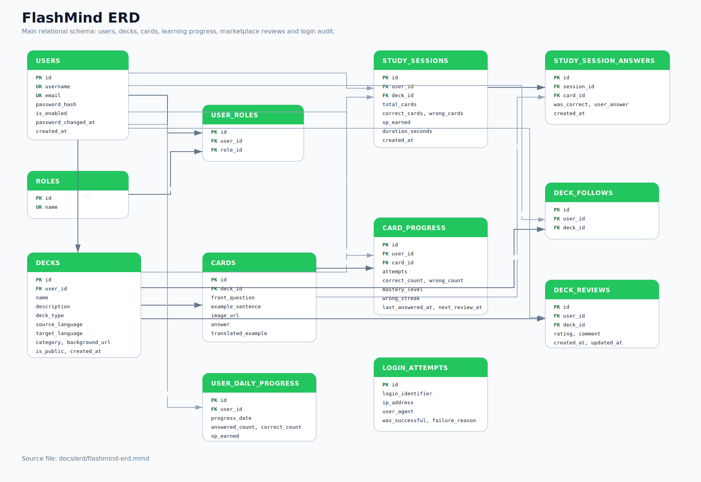

## Screeny Aplikacji

### Wersja Webowa

#### Logowanie

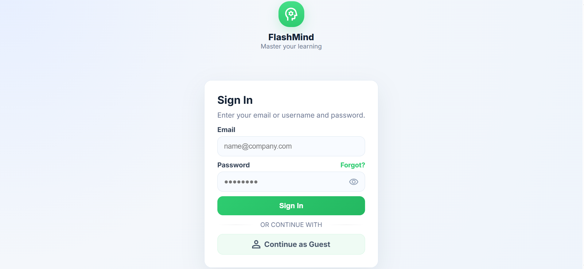

#### Dashboard

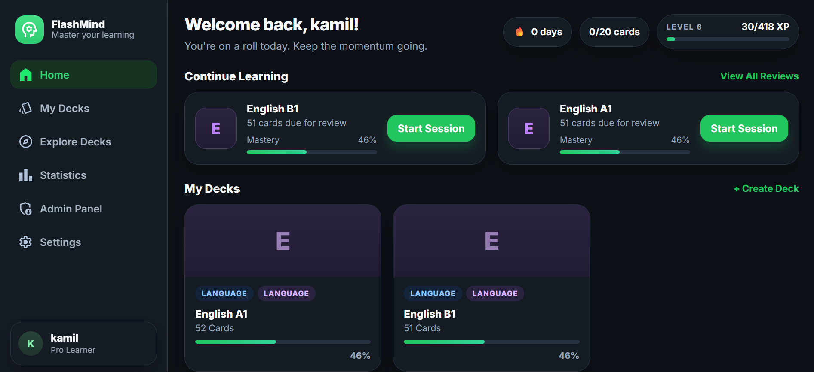

#### My Decks

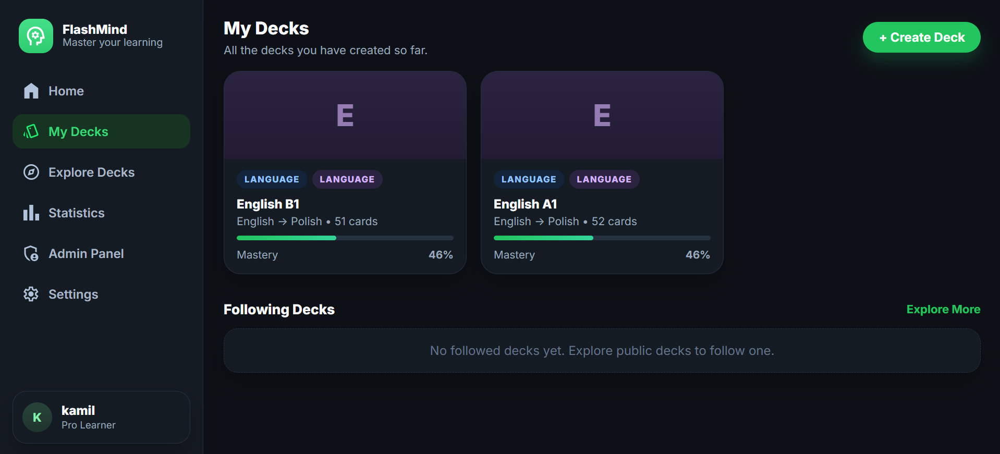

#### Widok Decka

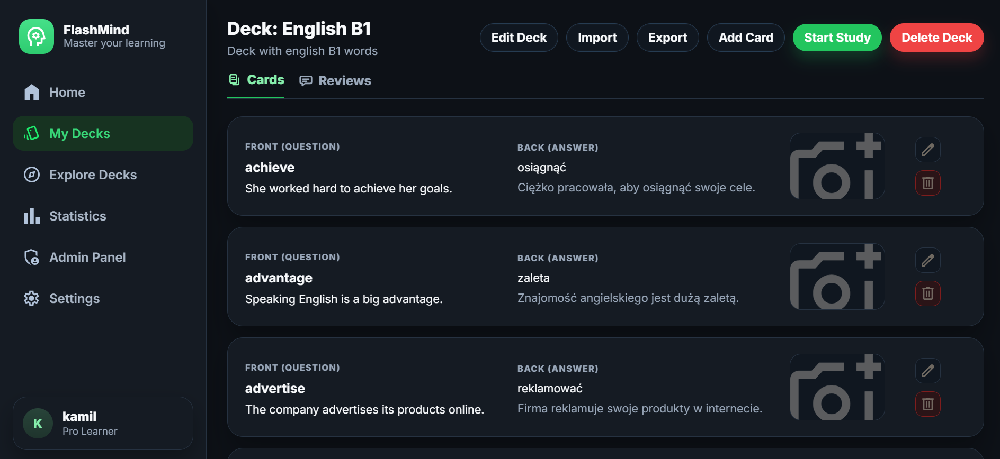

#### Study Session

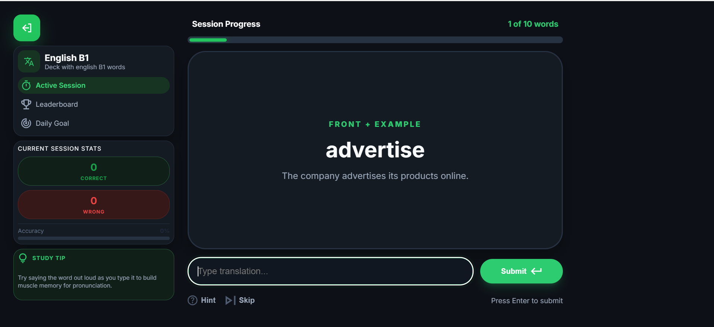

#### Explore Decks

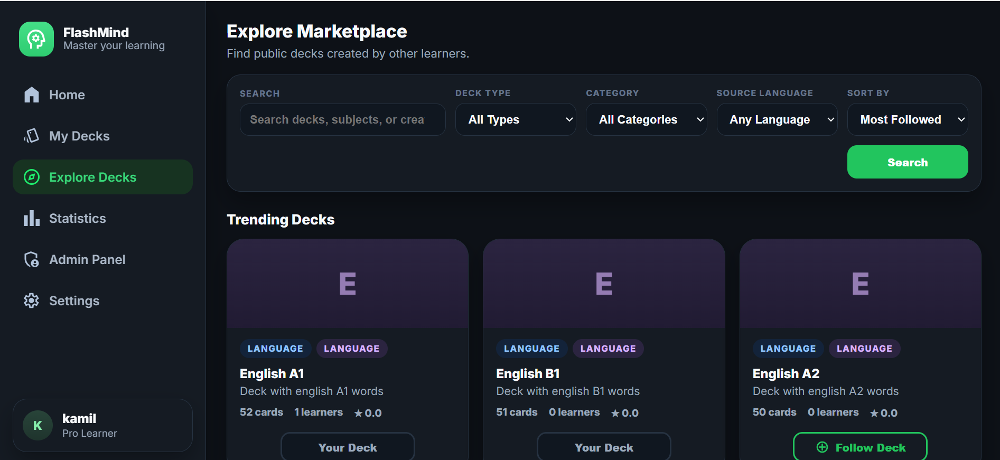

#### Statistics

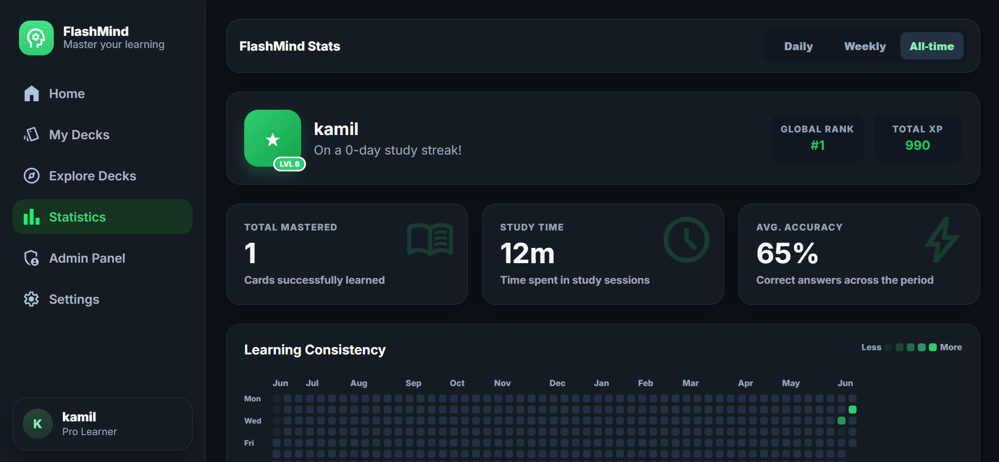

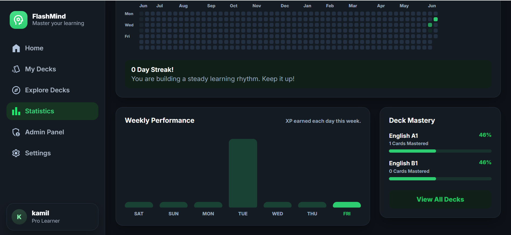

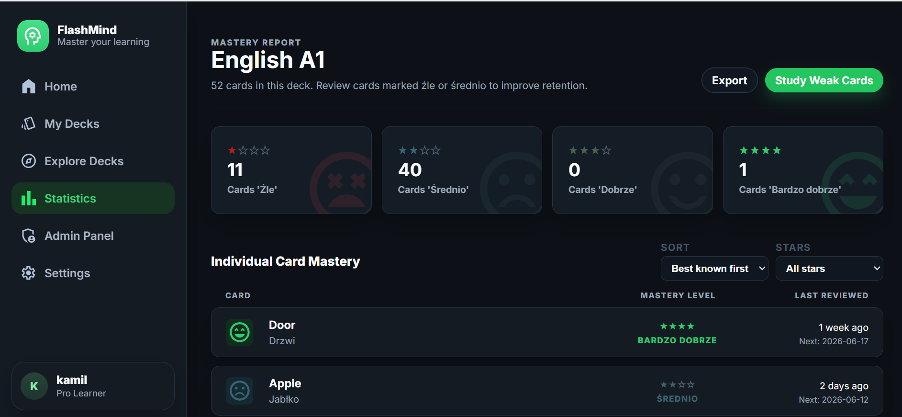

#### Settings

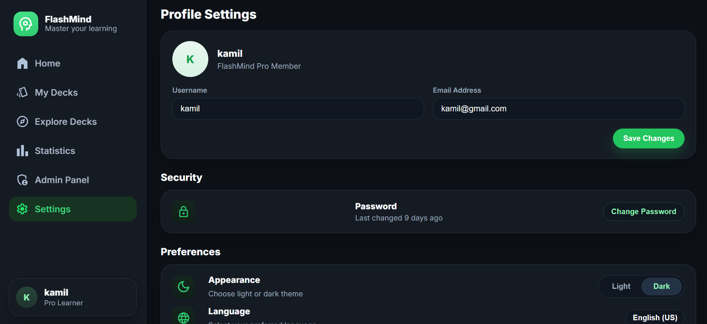

#### Admin Panel

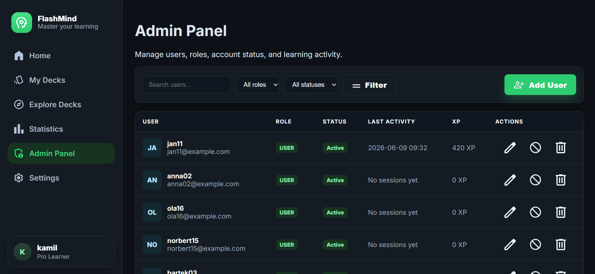

### Wersja Mobilna

#### Dashboard

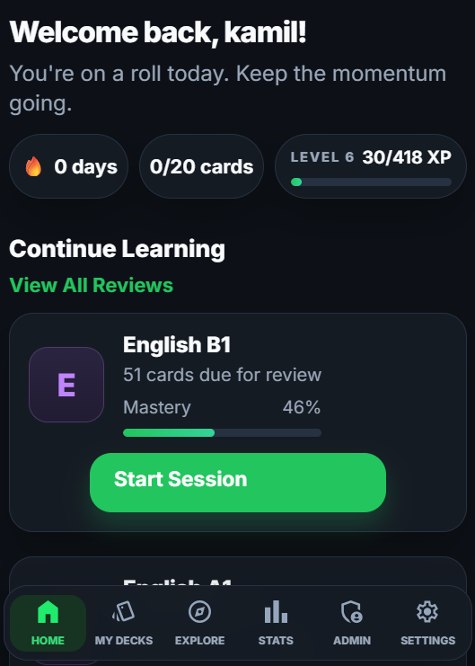

#### My Decks

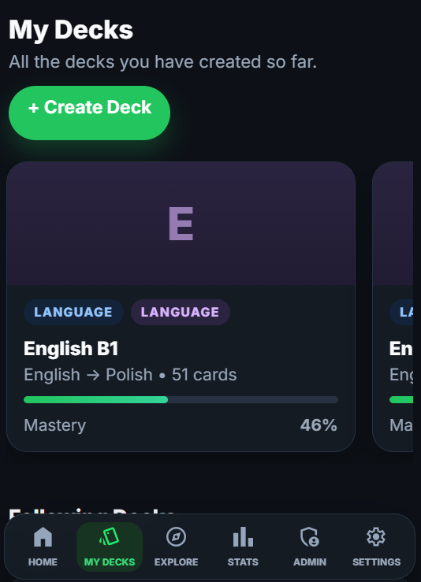

#### Explore Decks

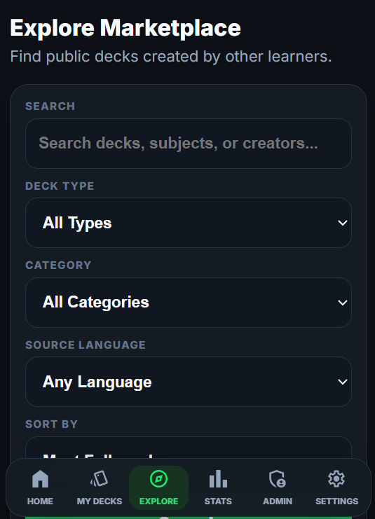

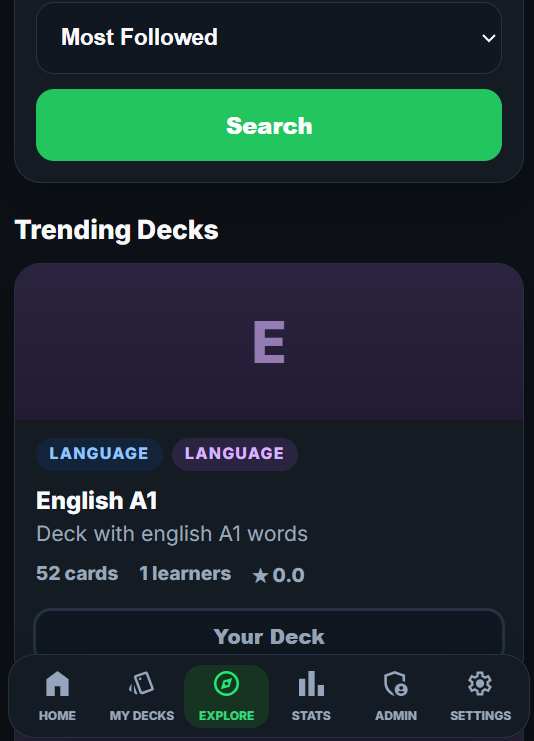

#### Study Session

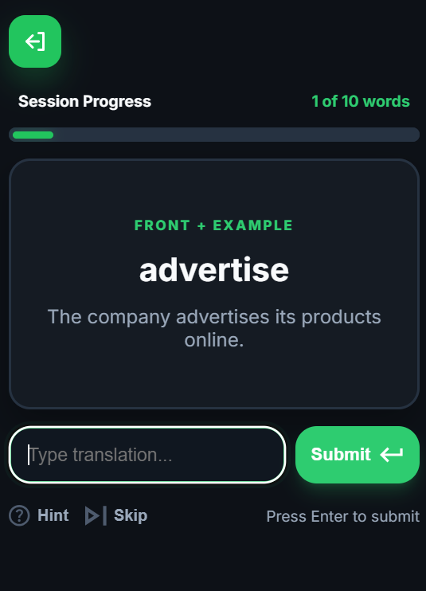

#### Statistics

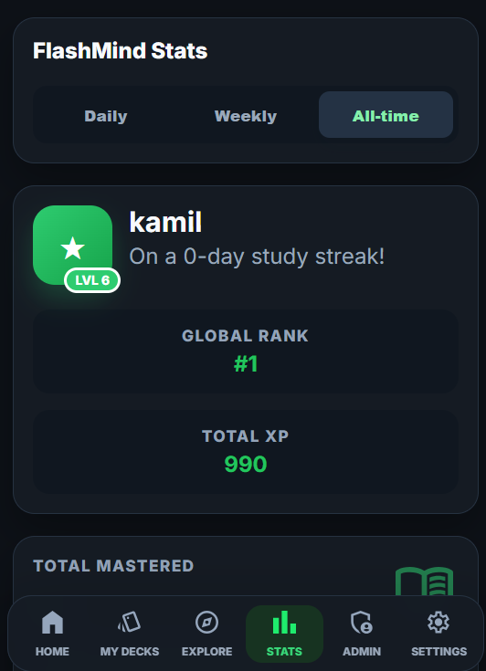

#### Settings

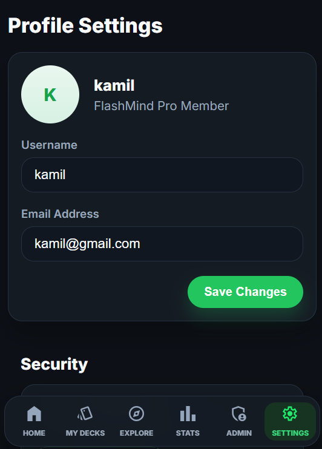

#### Admin Panel

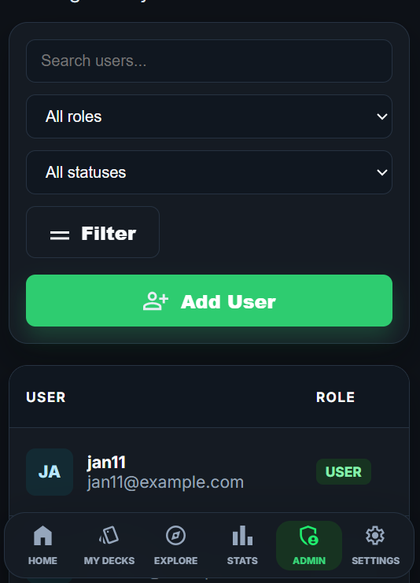

## Testy

Projekt zawiera testy jednostkowe i proste testy integracyjne endpointów.

Instalacja zależności testowych:

```bash
composer install
```

Uruchomienie testów jednostkowych:

```bash
composer test
```

Na Windows:

```powershell
.\vendor\bin\phpunit.bat
```

Testy integracyjne endpointów po uruchomieniu Dockera:

```powershell
powershell -ExecutionPolicy Bypass -File tests/integration/endpoints.ps1 -BaseUrl http://localhost:8080
```

Albo:

```bash
bash tests/integration/endpoints.sh
```

Zakres testów:

- kontrolery i ich publiczne akcje,
- serwisy,
- repozytoria,
- bezpieczeństwo repozytoriów,
- request i router,
- CSRF w bazowym kontrolerze,
- logika haseł,
- logika spaced repetition.

## Scenariusz Testowy

### 1. Rejestracja i Logowanie

1. Wejdź na `http://localhost:8080/register`.
2. Utwórz nowe konto.
3. Sprawdź walidację:
   - zajęty email,
   - zajęty username,
   - zbyt słabe hasło,
   - niezgodne hasła.
4. Wyloguj się.
5. Wejdź na `http://localhost:8080/login`.
6. Zaloguj się poprawnymi danymi.
7. Spróbuj kilka razy zalogować się błędnym hasłem i sprawdź blokadę czasową.

### 2. Role i Panel Admina

1. Zaloguj się jako administrator.
2. Wejdź w `Admin Panel`.
3. Dodaj użytkownika.
4. Edytuj użytkownika.
5. Zmień rolę użytkownika.
6. Zablokuj i odblokuj użytkownika.
7. Usuń użytkownika testowego.
8. Zaloguj się jako zwykły użytkownik i sprawdź, że `Admin Panel` nie jest dostępny w sidebarze.

### 3. CRUD Decków i Fiszek

1. Wejdź w `My Decks`.
2. Utwórz nowy deck.
3. Sprawdź, że po dodaniu następuje przekierowanie do widoku decka.
4. Dodaj kilka fiszek.
5. Edytuj fiszkę.
6. Usuń fiszkę.
7. Edytuj deck.
8. Usuń deck.

### 4. Import i Eksport CSV

1. Wejdź w szczegóły decka.
2. Wyeksportuj fiszki do CSV.
3. Zaimportuj CSV do decka.
4. Sprawdź, czy fiszki pojawiły się na liście.

### 5. Study Session i Spaced Repetition

1. Uruchom naukę decka.
2. Wpisz poprawną odpowiedź.
3. Sprawdź zieloną obwódkę fiszki.
4. Wpisz błędną odpowiedź.
5. Sprawdź czerwoną obwódkę fiszki.
6. Użyj hinta i odpowiedz poprawnie.
7. Sprawdź, że za odpowiedź z hintem naliczane jest mniej XP.
8. Zakończ sesję.
9. Sprawdź ekran podsumowania sesji.
10. Sprawdź aktualizację statystyk i mastery fiszek.

### 6. Explore Marketplace

1. Wejdź w `Explore Decks`.
2. Wyszukaj publiczny deck.
3. Użyj filtrów: deck type, category, source language, target language, sort.
4. Wejdź w publiczny deck.
5. Followuj deck.
6. Sprawdź, że pojawia się w `Following Decks`.
7. Uruchom naukę followowanego decka.
8. Dodaj recenzję do decka, którego nie jesteś właścicielem.
9. Edytuj lub usuń swoją recenzję.

### 7. Błędy 401/403 i Tryb Gościa

1. Kliknij `Continue as Guest`.
2. Przejrzyj publiczne decki.
3. Spróbuj wykonać akcję wymagającą konta.
4. Sprawdź widok `Account required`.
5. Zaloguj się i sprawdź, że dostęp wraca.
6. Spróbuj wejść na panel admina jako zwykły użytkownik.

### 8. Widoki, Funkcje i Wyzwalacze Bazy

W PgAdmin albo `psql` wykonaj:

```sql
SELECT * FROM public_deck_statistics;
SELECT * FROM user_learning_summary;
SELECT count_recent_failed_logins('test@example.com', '127.0.0.1', 10);
SELECT login_lock_remaining_seconds('test@example.com', '127.0.0.1', 5, 10, 300);
```

Następnie wykonaj kilka błędnych prób logowania i sprawdź:

```sql
SELECT * FROM login_attempts ORDER BY attempted_at DESC;
```

## Checklist

### Wymagania Technologiczne

- [x] Docker
- [x] Git
- [x] HTML5
- [x] CSS
- [x] JavaScript
- [x] Fetch API
- [x] PHP obiektowy
- [x] PostgreSQL
- [x] Brak frameworka
- [x] Brak gotowych szablonów

### Architektura i Kod

- [x] Architektura MVC
- [x] Kontrolery
- [x] Widoki
- [x] Repozytoria
- [x] Serwisy
- [x] Modele
- [x] Routing
- [x] Renderowanie widoków
- [x] Separacja CSS i JS do osobnych plików

### Funkcjonalności

- [x] Rejestracja
- [x] Logowanie
- [x] Wylogowanie
- [x] Sesja użytkownika
- [x] Role użytkowników
- [x] Panel administratora
- [x] Zarządzanie użytkownikami
- [x] CRUD decków
- [x] CRUD fiszek
- [x] Study session
- [x] Session summary
- [x] Statystyki użytkownika
- [x] Statystyki decków
- [x] Spaced repetition
- [x] XP i levele
- [x] Daily goal
- [x] Day streak
- [x] Explore Marketplace
- [x] Follow / unfollow decków
- [x] Recenzje decków
- [x] Import CSV
- [x] Eksport CSV
- [x] Tryb gościa
- [x] Dark mode
- [x] Responsywność
- [x] Widok mobilny z dolną nawigacją

### Bezpieczeństwo

- [x] Prepared statements
- [x] Hashowanie haseł
- [x] Walidacja email po stronie serwera
- [x] Walidacja długości danych wejściowych
- [x] Walidacja złożoności hasła
- [x] CSRF dla logowania i rejestracji
- [x] Regeneracja ID sesji po logowaniu
- [x] Poprawne niszczenie sesji przy wylogowaniu
- [x] Cookie `HttpOnly`
- [x] Cookie `SameSite`
- [x] Cookie `Secure` konfigurowalne przez `.env`
- [x] Limit prób logowania
- [x] Logowanie nieudanych prób logowania bez haseł
- [x] Brak stack trace w produkcji
- [x] Escaping danych w widokach

### Baza Danych

- [x] Relacje jeden-do-wielu
- [x] Relacje wiele-do-wielu
- [x] Relacje przez tabele łączące
- [x] Klucze główne i obce
- [x] `ON DELETE CASCADE`
- [x] Widok `public_deck_statistics`
- [x] Widok `user_learning_summary`
- [x] Funkcja `count_recent_failed_logins`
- [x] Funkcja `login_lock_remaining_seconds`
- [x] Trigger `trg_cleanup_old_login_attempts`
- [x] Transakcja przy zapisie sesji nauki
- [x] Plik SQL inicjalizujący bazę